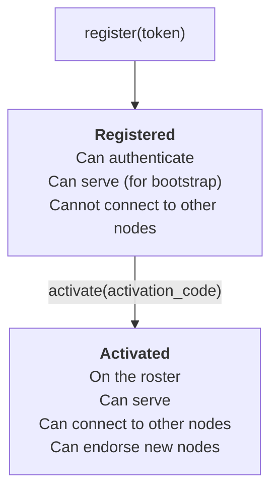
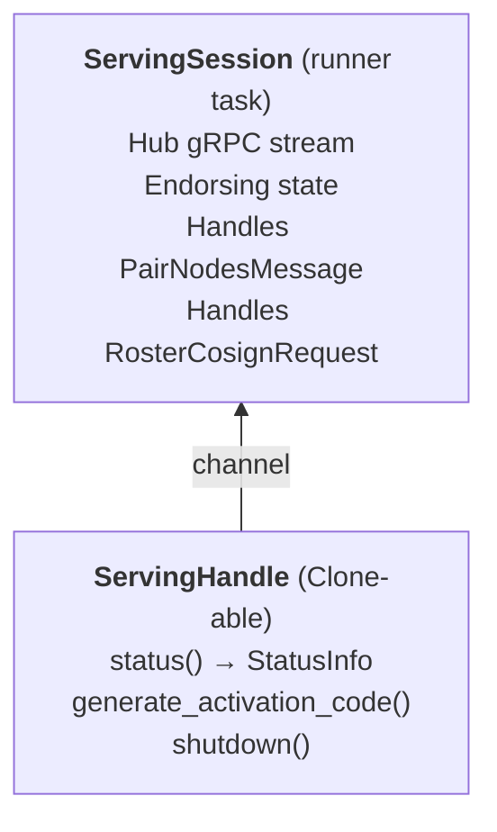
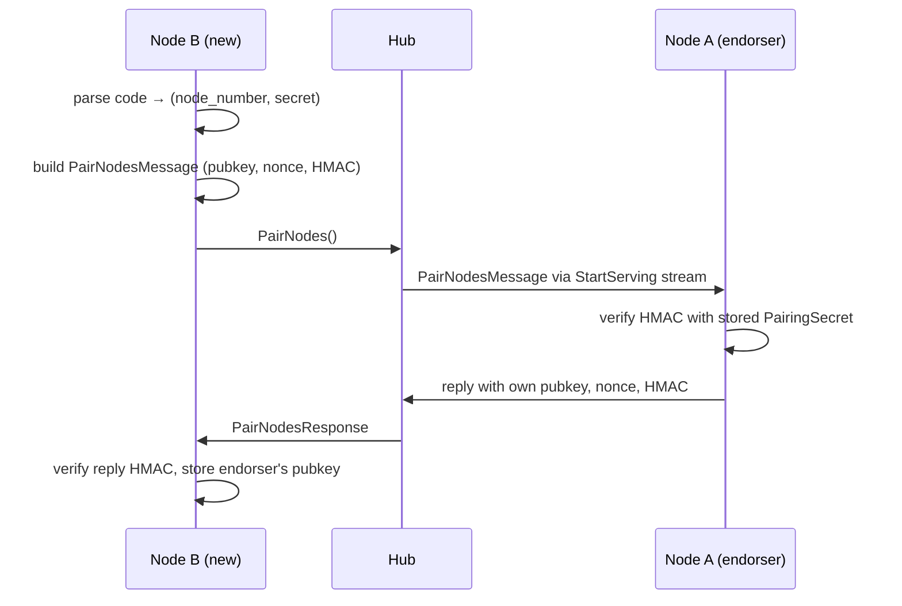
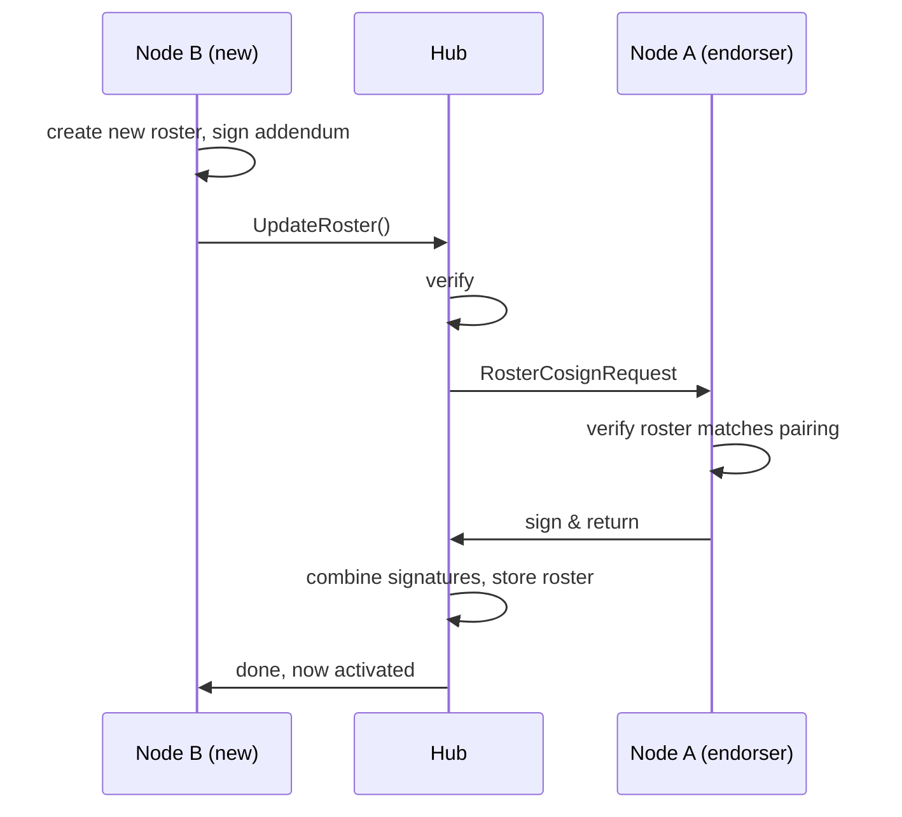
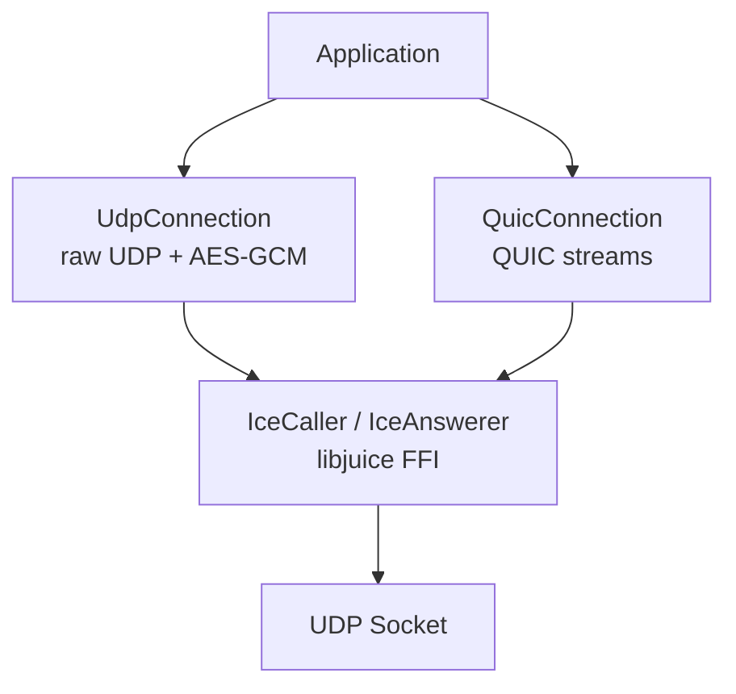

# Internals

Code map, module responsibilities, and key types for contributors and
curious integrators.

## Directory structure

```
wispers-client/
├── wispers-connect/        # Core Rust library (see module details below)
│   ├── src/
│   ├── include/            # C header (wispers_connect.h)
│   └── proto/              # Protobuf definitions
├── wrappers/
│   ├── kotlin/             # Kotlin/Android JNA wrapper
│   └── go/                 # Go CGo wrapper
├── wconnect/               # CLI tool
├── wcadm/                  # Admin CLI
├── third_party/
│   └── libjuice/           # ICE library (C git submodule, built via CMake)
└── docs/                   # This directory
```

## wispers-connect modules

Each file has a `//!` doc comment at the top with more detail.

| Module | Role |
|--------|------|
| `node.rs` | `Node` type, state machine, `NodeStorage` |
| `hub.rs` | gRPC client for the Hub |
| `serving.rs` | `ServingSession` (runner) + `ServingHandle` (control) |
| `types.rs` | `NodeInfo`, `GroupInfo`, `NodeRegistration` |
| `crypto.rs` | Signing keys, X25519, pairing codes/secrets |
| `roster.rs` | Roster creation, verification, signing |
| `p2p.rs` | `UdpConnection`, `QuicConnection`, `QuicStream` |
| `quic.rs` | QUIC implementation (quiche + TLS-PSK) |
| `ice.rs` | ICE negotiation (high-level) |
| `juice.rs` | libjuice FFI bindings (low-level) |
| `encryption.rs` | AES-GCM encryption for UDP |
| `storage/` | `NodeStateStore` trait + file/in-memory implementations |
| `errors.rs` | `WispersStatus` codes, `NodeStateError` |
| `ffi/` | C FFI boundary (opaque handles, async callbacks) |

### Node state machine



## Key types

| Type | Location | Purpose |
|------|----------|---------|
| `Node` | `node.rs` | Main entry point; wraps state and provides operations |
| `NodeState` | `node.rs` | Enum: `Unregistered` / `Registered` / `Activated` |
| `NodeStorage` | `node.rs` | Persistence wrapper; `restore_or_init_node()` |
| `ServingHandle` | `serving.rs` | Clone-able control handle for a serving session |
| `ServingSession` | `serving.rs` | Runner that owns the hub gRPC stream |
| `IncomingConnections` | `serving.rs` | Stream of incoming P2P connection requests |
| `SigningKeyPair` | `crypto.rs` | Ed25519 signing key pair |
| `PairingSecret` | `crypto.rs` | Raw 10-byte secret for pairing HMAC |
| `PairingCode` | `crypto.rs` | User-facing `{node}-{secret}` string |
| `NodeInfo` | `types.rs` | Per-node metadata in a group |
| `GroupInfo` | `types.rs` | Full group state with node list |
| `UdpConnection` | `p2p.rs` | Encrypted UDP connection (AES-GCM) |
| `QuicConnection` | `p2p.rs` | QUIC connection (reliable, multiplexed) |
| `QuicStream` | `p2p.rs` | Single bidirectional stream within a QUIC connection |
| `IceCaller` / `IceAnswerer` | `ice.rs` | ICE negotiation endpoints |

Wrapper equivalents:

| Rust | Go | Kotlin |
|------|----|--------|
| `Node` | `wispersgo.Node` | `dev.wispers.connect.Node` |
| `ServingHandle` | `wispersgo.ServingHandle` | `dev.wispers.connect.ServingSession` |
| `UdpConnection` | `wispersgo.UdpConnection` | `dev.wispers.connect.UdpConnection` |
| `QuicConnection` | `wispersgo.QuicConnection` | `dev.wispers.connect.QuicConnection` |
| `NodeInfo` | `wispersgo.NodeInfo` | `dev.wispers.connect.NodeInfo` |

## FFI boundary

The Rust library compiles to a `cdylib` shared library
(`libwispers_connect.so` / `.dylib`) with a C API defined in
`include/wispers_connect.h`.

### Pattern

All async operations follow a callback pattern:

1. Caller passes a function pointer and an opaque `void *ctx`
2. Rust spawns the operation on the tokio runtime
3. On completion, Rust calls the callback with `ctx`, a `WispersStatus`
   code, an optional error string, and any result values

### Memory ownership

- **Opaque handles** (`WispersNodeHandle *`, `WispersServingHandle *`, etc.)
  are owned by the caller and freed with the corresponding `_free()` function.
- **Struct arrays** (`WispersNode *` in `WispersGroupInfo`) are freed by
  their parent's free function (`wispers_group_info_free`).
- **Strings** returned in callbacks (error details, activation codes) are
  valid only for the duration of the callback.

### Known pitfalls

- **JNA Boolean vs Rust bool**: JNA maps `Boolean` to a 4-byte C `int`,
  but Rust `#[repr(C)]` `bool` is 1 byte. Garbage in padding bytes causes
  `false` to read as `true`. Fix: use `Byte` in JNA structs, convert with
  `!= 0.toByte()`.
- **`Structure.toArray()`**: JNA's `toArray()` does not `read()` the first
  element — call `read()` explicitly before `toArray()`.
- **Callback GC**: JNA holds weak references to callback objects. The host
  must keep strong references to prevent garbage collection while native
  code holds the pointer.

## Serving architecture

The library's serving API is split into two parts:

- **`ServingSession`** — owns the hub gRPC stream. Runs as a spawned
  tokio task. Handles incoming `PairNodesMessage` (pairing requests)
  and `RosterCosignRequest` (endorsement).
- **`ServingHandle`** — a `Clone`-able handle that communicates with
  the session via channels. Exposes `status()`,
  `generate_activation_code()`, and `shutdown()`.



Any application that embeds the library uses this split — `wconnect` is
just one example.

## wconnect daemon mode

When running `wconnect serve -d`, the process daemonizes and listens on a
Unix socket at `~/.wconnect/sockets/{cg_id}-{node}.sock`. Other `wconnect`
invocations detect the daemon and communicate via this socket.

Commands are newline-delimited JSON:

```json
// Requests
{"cmd": "status"}
{"cmd": "get_activation_code"}
{"cmd": "shutdown"}

// Responses
{"ok": true, "data": {"connected": true, "node_number": 1, ...}}
{"ok": false, "error": "not connected to hub yet"}
```

CLI commands that use the daemon:
- `wconnect status` — shows daemon status if running
- `wconnect get-activation-code` — asks daemon to generate code
- `wconnect serve --stop` — sends shutdown command

## Activation flow (code path)

From [DESIGN.md](../../DESIGN.md), activation has two phases. Here's how
they map to code:

### Phase 1: Pairing



### Phase 2: Roster update



## P2P transport internals

Activated nodes can establish peer-to-peer connections using two transports:



| Transport | Use case | Properties |
|-----------|----------|------------|
| `UdpConnection` | Low-latency, fire-and-forget | AES-GCM encryption, unreliable delivery |
| `QuicConnection` | Reliable data transfer | TLS 1.3 PSK, ordered streams, flow control |

### QUIC authentication

QUIC uses TLS 1.3 Pre-Shared Key (PSK) mode, not certificates:
- PSK derived from X25519 DH exchange (same keys used for UDP encryption)
- Server generates an ephemeral in-memory cert (BoringSSL requirement)
- No certificate verification needed — authentication is via the shared PSK

### Connection flow

1. Caller requests `StunTurnConfig` from hub
2. Both sides gather ICE candidates via libjuice
3. Caller sends `StartConnectionRequest` (includes transport type, X25519
   pubkey)
4. Answerer verifies signature, responds with own X25519 pubkey
5. ICE negotiation establishes UDP path
6. For QUIC: PSK handshake over the ICE transport, then streams available

## Proto definitions

From `proto/hub.proto`:

| Message | Direction | Purpose |
|---------|-----------|---------|
| `PairNodesMessage` | B -> Hub -> A -> Hub -> B | Exchange pubkeys with HMAC |
| `RosterCosignRequest` | Hub -> A | Ask endorser to co-sign new roster |
| `RosterCosignResponse` | A -> Hub | Endorser's signature |
| `UpdateRosterRequest` | B -> Hub | Submit new roster for activation |
| `Welcome` | Hub -> Node | Sent on `StartServing` connect |

From `proto/roster.proto`: `Roster`, `Addendum`, `Revocation` — the
signed membership structures that nodes verify locally.

From `proto/storage.proto`: serialization format for `PersistedNodeState`,
used by the FFI foreign-storage path.

